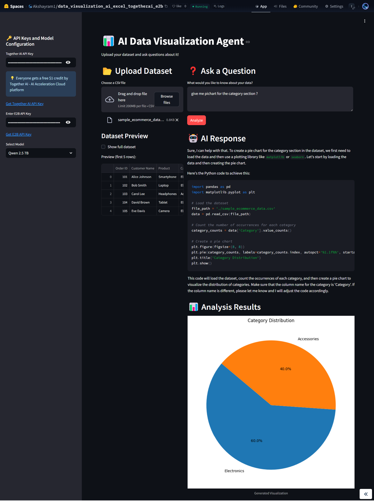

# 📊 AI Data Visualization Agent

An intelligent Streamlit-powered application that serves as your personal data visualization expert. This tool combines the power of Large Language Models (LLMs) with data analysis capabilities to help you understand and visualize your data through natural language interactions.

## 🎯 Demo

*AI-powered data visualization interface in action*

## 🌟 Key Features

### 🗣️ Natural Language Interface
- Upload any dataset and ask questions in plain English
- Get instant, context-aware responses and visualizations
- Interactive conversation flow for follow-up questions
- Detailed explanations of insights and findings

### 📈 Advanced Visualization Capabilities
- Smart auto-selection of appropriate chart types based on data
- Support for multiple visualization types:
  - Scatter plots, line charts, bar graphs
  - Box plots and histograms
  - Correlation matrices
  - Heat maps
  - Time series analysis
- Custom styling and formatting options
- Interactive plot manipulation

### 🤖 Multi-Model AI Architecture
- **Meta-Llama 3.1 405B**: Powers complex data analysis and pattern recognition
- **DeepSeek V3**: Provides detailed statistical insights and explanations
- **Qwen 2.5 7B**: Handles quick analysis and basic queries
- **Meta-Llama 3.3 70B**: Manages advanced analytical queries and relationships

## 🚀 Getting Started

### Prerequisites
- Python 3.8 or higher
- Together AI API Key (Get it [here](https://api.together.ai/signin))
- E2B API Key (Get it [here](https://e2b.dev/))

### Platform Overview

#### Together AI Platform
Together AI is a comprehensive cloud platform for generative AI development that powers this application with:
- Access to 200+ generative AI models
- High-performance model inference
- Advanced optimizations:
  - Transformer-optimized kernels
  - Speculative decoding
  - GPU cluster management
- Key benefits:
  - Fast inference speeds
  - Cost-effective processing
  - Scalable infrastructure
  - Enterprise-grade reliability

#### E2B Development Platform
E2B.dev provides the secure runtime environment for our AI-generated visualizations:
- Isolated cloud sandboxes for code execution
- Multi-language support
- Secure execution environment for:
  - Data analysis operations
  - Visualization rendering
  - Code interpretation
- Key features:
  - Real-time code execution
  - Isolated environments
  - Automatic resource management
  - Built-in security measures

### API Key Setup
1. **Together AI Setup**
   - The API key enables access to LLM models
   - Free tier includes:
     - 5M tokens per month
     - Access to all base models
     - Rate limit: 10 requests/minute
   - Usage monitoring available in dashboard

2. **E2B Setup**
   - Required for serverless runtime environment
   - Free tier includes:
     - 100 hours of compute time
     - Standard processing power
     - Basic monitoring
   - Set resource limits in dashboard

### Installation

1. **Clone the Repository**
   ```bash
   git clone https://github.com/akshayram1/ai_data_visualisation_agent_excel.git
   cd ai_data_visualisation_agent_excel
   ```

2. **Set Up Virtual Environment (Recommended)**
   ```bash
   python -m venv venv
   source venv/bin/activate  # On Windows: venv\Scripts\activate
   ```

3. **Install Dependencies**
   ```bash
   pip install -r requirements.txt
   ```

4. **Configure API Keys**
   - Create a `.env` file in the project root
   - Add your API keys:
     ```
     TOGETHER_API_KEY=your_together_api_key
     E2B_API_KEY=your_e2b_api_key
     ```

5. **Launch the Application**
   ```bash
   streamlit run app.py
   ```

## 💡 Usage Guide

1. **Data Upload**
   - Support for CSV, Excel, and JSON formats
   - Automatic data type detection
   - Basic data cleaning and preprocessing

2. **Asking Questions**
   - Use natural language to query your data
   - Examples:
     - "Show me the trend of sales over time"
     - "What's the correlation between price and quantity?"
     - "Create a histogram of customer ages"

3. **Interpreting Results**
   - Each visualization comes with explanatory text
   - Statistical significance indicators where applicable
   - Options to download visualizations and data

## 🤝 Contributing

Contributions are welcome! Please feel free to submit a Pull Request. For major changes, please open an issue first to discuss what you would like to change.

## 📝 License

This project is licensed under the MIT License - see the LICENSE file for details.

## 🙏 Acknowledgments

- Together AI for providing the LLM infrastructure
- E2B for their API services
- Streamlit for the web framework
- The open-source community for various dependencies

## 📧 Contact

For questions and support, please open an issue in the GitHub repository or contact the maintainers directly.
